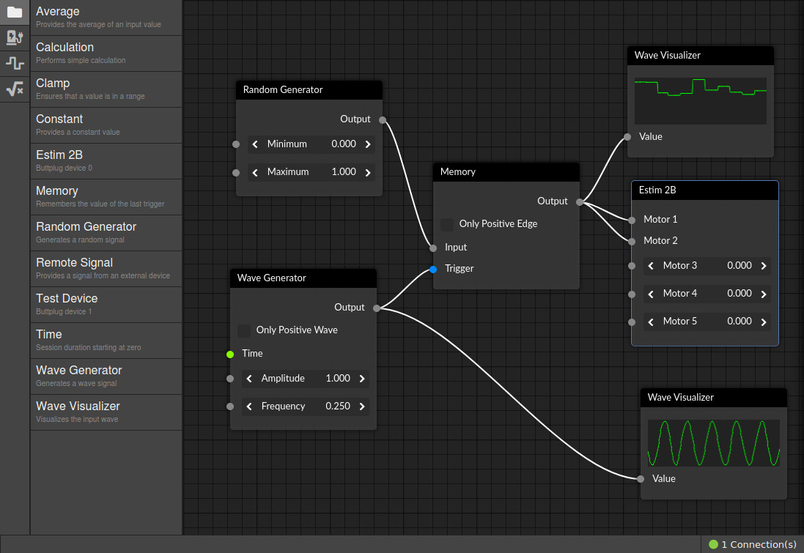

# Buttplug.io Interactive Editor



Graph editor for [Buttplug.IO](https://www.buttplug.io). Use this editor to design your own sessions simply by drag and drop.

Automatically connects to ws://127.0.0.1:12345/ on startup. Reload page if the server was not running at the moment.

This project is currently **highly WIP**, feel free to test it, but don't expect everything to work yet :)

## Project setup
```
yarn install
```

### Compiles and hot-reloads for development
```
yarn serve
```

### Compiles and minifies for production
```
yarn build
```

### Lints and fixes files
```
yarn lint
```